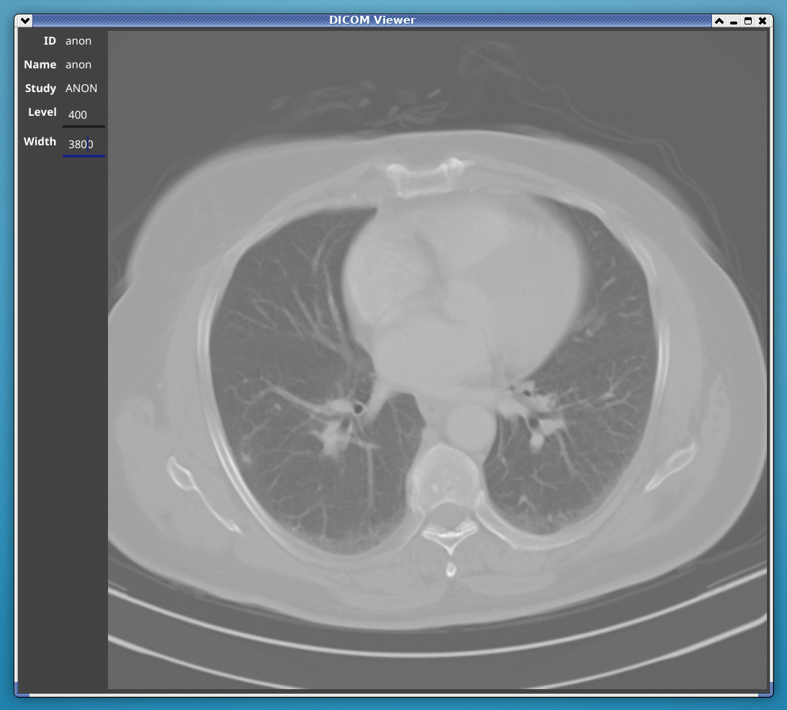

# dicomgraphics

A DICOM image viewer and utilities.

## dicomviewer

A simple viewer application for DICOM images with variable window parameters.

Built using the [Fyne](https://fyne.io) toolkit.

### Usage

```sh
go get -u github.com/fynelabs/dicomgraphics/cmd/dicomviewer
dicomviewer <filename.dcm>
```

And you should see something like the following:



Data in the screenshot is CC BY 3.0 from Clark K, Vendt B, Smith K, Freymann J, Kirby J, Koppel P, Moore S, Phillips S, Maffitt D, Pringle M, Tarbox L, Prior F. The Cancer Imaging Archive (TCIA): Maintaining and Operating a Public Information Repository, Journal of Digital Imaging, Volume 26, Number 6, December, 2013, pp 1045-1057. (paper)

## dicom2jpg

A command line utility to convert DICOM image frames to jpeg files.

### Usage

```sh
go get -u github.com/fynelabs/dicomgraphics/cmd/dicom2jpg
dicom2jpg <filename.dcm>
```

The command will output a `jpg` file in the same directory as the `.dcm`.
